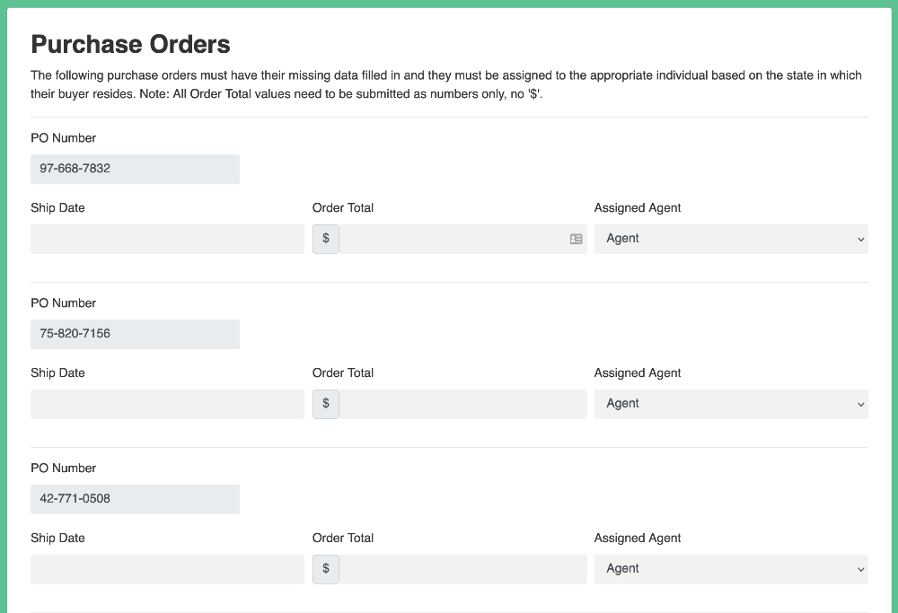

# A robot that completes the supply chain challenge



This example robot completes the supply chain challenge at https://developer.automationanywhere.com/challenges/automationanywherelabs-supplychainmanagement.html.

```robot
*** Tasks ***
Complete supply chain challenge
    Open Browser
    ${procurement_website}=    Open procurement website
    Log in    ${procurement_website}
    ${po_website}=    Open purchase orders website
    ${agents}=    Get agents    ${po_website}
    Fill in purchase orders
    ...    ${agents}
    ...    ${procurement_website}
    ...    ${po_website}
    Take a screenshot of the result
```
